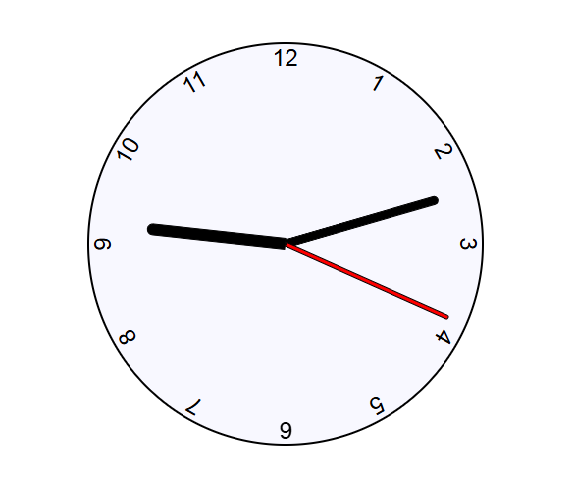

# Analog Clock (Vanilla JS) ⏰

[](https://kiettt23.github.io/analog-clock)


A smooth, CSS-powered analog clock. Built with **HTML, CSS, and Vanilla JS** — no frameworks.

👉 **Live demo:** [https://kiettt23.github.io/analog-clock](https://kiettt23.github.io/analog-clock)

---

## Highlights

- CSS custom property `--rotation` + `transform-origin` to rotate hands smoothly.
- Minute/Hour hands use interpolation to avoid tick jumps.
- Zero dependencies, tiny codebase.
- Responsive layout, runs directly in browser.

---

## Screenshot



---

## What I learned

- Mapping time → degrees using JavaScript Date API.
- Avoiding drift & jumps by separating UI (CSS var) from logic (JS).
- Absolute positioning & transform techniques for clean layout.

---

## Project structure

```
/ # project root
├── index.html     # semantic structure
├── style.css      # styles and layout
├── index.js       # sets --rotation for clock hands
├── LICENSE
├── README.md
└── docs/
    └── screenshot.png  # used in README
```

---

## Run locally

Just open `index.html` in your browser.

---

## Roadmap

- [ ] Dark mode (prefers-color-scheme)
- [ ] Small digital time overlay
- [ ] Reduced motion fallback

---

## License

MIT — see [LICENSE](./LICENSE).
